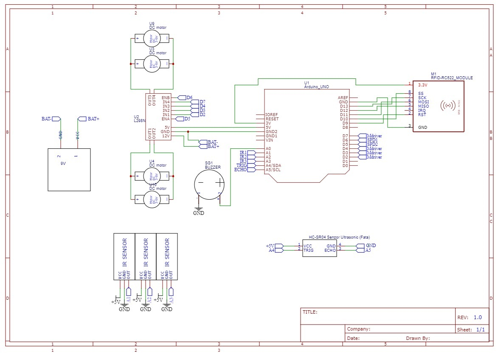

# RFID Follower

### How it works?

The RFID-Follower robot is an automated system that transports objects within factories or other production-oriented spaces. It follows a line drawn on the floor using infrared sensors and performs various tasks such as loading and unloading, based on information read from RFID cards placed along the route.

### What is its purpose?

The goal of this robot is to optimize logistics processes in production spaces, reducing the time spent manually handling objects and minimizing errors. It is a solution that improves work efficiency and safety.

### What was the inpiration?

I started from the need to automate internal transport in small or medium-sized factories, where the costs of a complex industrial solution are difficult to justify. The idea was to create a simple, affordable and customizable device that would meet the specific needs of users.

### Why it's useful?

RFID-Follower is useful for others because it offers an efficient, economical and easy-to-implement solution in various industrial fields. For me, it represents an opportunity to put into practice the knowledge of robotics, electronics and programming, contributing to the development of technologies applied in the real world.

### Block Diagram

## Hardware Design

### Electrical Diagram

### Bill of Materials

|#   | Name   | Quantity | Datasheet   | Place of Aquisition
|:---:|---|:---:|:---:|:---:|
| 1  |  [Arduino Uno]([https://www.sigmanortec.ro/placa-dezvoltare-esp32-cu-wifi-si-bluetooth](https://www.sigmanortec.ro/Placa-dezvoltare-UNO-R3-Arduino-Compatibil-ATmega328p-CH340G-cu-bara-pini-p170362384)) | 1  |  link  | Sigmanortec
| 2  |  [Dual H-Bridge Motor Driver L298N](https://www.sigmanortec.ro/Punte-H-Dubla-L298N-p125423236) | 1  | https://www.st.com/resource/en/datasheet/l298.pdf  | Sigmanortec
| 3  |  [2WD car chassis kit, line follower](https://www.sigmanortec.ro/Kit-sasiu-masina-2WD-urmaritor-linie-p172447939) | 1  |  N/A  | Sigmanortec
| 4  |  [Suport 6 baterii AA cu capac si intrerupator](https://www.sigmanortec.ro/Suport-6-baterii-AA-cu-capac-si-intrerupator-p209447210) | 1   |    N/A | Sigmanortec
| 5  |  [Set 6 baterii Duracell Plus Power AA LR06](https://www.auchan.ro/duracel-basic-aak4-4---2-gratis/p) | 1   |    N/A | Auchan
| 6  |  Ultrasonic Sensor | 1   | https://www.electroschematics.com/wp-content/uploads/2013/07/HCSR04-datasheet-version-1.pdf  | Faculty
| 7  |  Buzzer | 1      | https://www.farnell.com/datasheets/2171929.pdf | Faculty
| 8  |  Kit RFID Module | 1  |  https://literature.rockwellautomation.com/idc/groups/literature/documents/td/56rf-td001_-en-p.pdf | Faculty
| 9  |  [3 Channel Line Tracking Module](https://www.sigmanortec.ro/Modul-Urmarire-Linie-3-Canale-p148570939) | 1  | https://www.data-media.gr/files/KS0453.pdf | Sigmanortec
| 10 | Jumper Wires | many | N/A | Faculty

### Arduino Uno Pins

| Pin | Functionality | Use|
| ------------- | ------------- | -------------|
| 3V | 3.3V power supply | Provides a 3.3V power supply to components in the circuit|
| 5V | 5V | Connect the Motors to the Arduino Uno(Driver) |
|GND2| ground | Ground is the reference point for all voltages in the circuit, ensuring that the components operate correctly|
|A0| positive point of the buzzer |Connects to the positive point of the buzzer|
|A1|IR1 | Connects the sensor to the Arduino Uno |
|A2|IR2 | Connects the sensor to the Arduino Uno |
|A3|IR3 | Connects the sensor to the Arduino Uno |
|SDA|trig |Sends signals to some object |
|SCL|echo |Receive signals from some object |
|GND| ground | Ground for RFID Module|
|D12| SPI MISO| Connected to the RFID, receives data from the RFID|
|D11| SPI MOSI| Connected to the RFID, transmits data to the RFID|
|D13| SPI SCK| Connected to the RFID, generates the clock signal to synchronize data transfer between the controller and the peripheral|
|D10| SPI SS| Connected to the RFID, used to enable or disable communication with the specific SPI peripheral|
|D9|RST |Connected to the RFID, used to reset the module |
|D7|MDriver |Motor driver control connections |
|D6|SPD1 |PWM signals from the Arduino used for motor speed control |
|D5|SPD2 | PWM signals from the Arduino used for motor speed control|
|D4|MDriver|Motor driver control connections |
|D3|MDriver|Motor driver control connections |
|D2|MDriver|Motor driver control connections |

### RFID Pins

| Pin | Pin label | Use|
| ------------- | ------------- | -------------|
| 3.3V | 3V power supply | Provides a 3V power supply to components in the module|
|2     | RST | Used to reset the RFID module |
|3     | GND |Ground connection|
|5     | MISO |SPI communication, transmits data to the controller|
|6     | MOSI | SPI communication, receives data from the controller|
|7     | SKC | SPI bus clock signal, SPI communication, used for timing and synchronization|
|8     | SS | SPI connection for controlling which slave device is active |

## Software Design

## Results

## Conclusions
