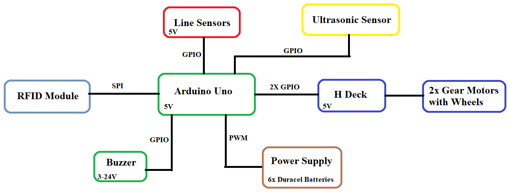
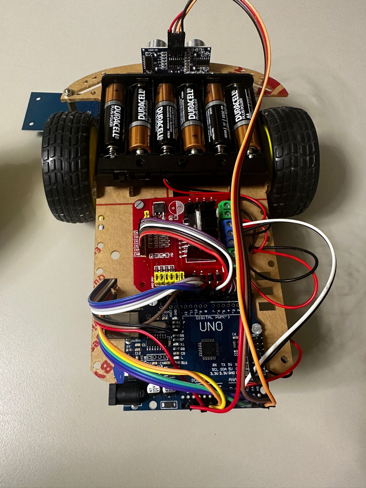

# RFID Follower

### How it works?

The RFID-Follower robot is an automated system that transports objects within factories or other production-oriented spaces. It follows a line drawn on the floor using infrared sensors and performs various tasks such as loading and unloading, based on information read from RFID cards placed along the route.

### What is its purpose?

The goal of this robot is to optimize logistics processes in production spaces, reducing the time spent manually handling objects and minimizing errors. It is a solution that improves work efficiency and safety.

### What was the inpiration?

I started from the need to automate internal transport in small or medium-sized factories, where the costs of a complex industrial solution are difficult to justify. The idea was to create a simple, affordable and customizable device that would meet the specific needs of users.

### Why it's useful?

RFID-Follower is useful for others because it offers an efficient, economical and easy-to-implement solution in various industrial fields. For me, it represents an opportunity to put into practice the knowledge of robotics, electronics and programming, contributing to the development of technologies applied in the real world.

## Project Description 

RFID Follower is a robot for transporting objects in factories or other production-oriented spaces. The robot uses three infrared sensors to follow a line and has two direct current geared motors for movement. With the help of the RFID reader, it recognizes RFID cards on the route, each indicating stopping places with different durations and actions. To prevent collisions, it is equipped with a front ultrasonic sensor, alerting the operator with an audible alarm.
The RFID cards are independent, each with its action being placed next to the route, with different action execution times.

## Hardware Design

### Block Diagram

### Electrical Diagram

### Bill of Materials

|#   | Name   | Quantity | Datasheet   | Place of Aquisition
|:---:|---|:---:|:---:|:---:|
| 1  |  [Arduino Uno]([https://www.sigmanortec.ro/placa-dezvoltare-esp32-cu-wifi-si-bluetooth](https://www.sigmanortec.ro/Placa-dezvoltare-UNO-R3-Arduino-Compatibil-ATmega328p-CH340G-cu-bara-pini-p170362384)) | 1  |  link  | Sigmanortec
| 2  |  [Dual H-Bridge Motor Driver L298N](https://www.sigmanortec.ro/Punte-H-Dubla-L298N-p125423236) | 1  | https://www.st.com/resource/en/datasheet/l298.pdf  | Sigmanortec
| 3  |  [2WD car chassis kit, line follower](https://www.sigmanortec.ro/Kit-sasiu-masina-2WD-urmaritor-linie-p172447939) | 1  |  N/A  | Sigmanortec
| 4  |  [Suport 6 baterii AA cu capac si intrerupator](https://www.sigmanortec.ro/Suport-6-baterii-AA-cu-capac-si-intrerupator-p209447210) | 1   |    N/A | Sigmanortec
| 5  |  [Set 6 baterii Duracell Plus Power AA LR06](https://www.auchan.ro/duracel-basic-aak4-4---2-gratis/p) | 1   |    N/A | Auchan
| 6  |  Ultrasonic Sensor | 1   | https://www.electroschematics.com/wp-content/uploads/2013/07/HCSR04-datasheet-version-1.pdf  | Faculty
| 7  |  Buzzer | 1      | https://www.farnell.com/datasheets/2171929.pdf | Faculty
| 8  |  Kit RFID Module | 1  |  https://literature.rockwellautomation.com/idc/groups/literature/documents/td/56rf-td001_-en-p.pdf | Faculty
| 9  |  [3 Channel Line Tracking Module](https://www.sigmanortec.ro/Modul-Urmarire-Linie-3-Canale-p148570939) | 1  | https://www.data-media.gr/files/KS0453.pdf | Sigmanortec
| 10 | Jumper Wires | many | N/A | Faculty

### Arduino Uno Pins

| Pin | Functionality | Use|
| ------------- | ------------- | -------------|
| 3V | 3.3V power supply | Provides a 3.3V power supply to components in the circuit|
| 5V | 5V | Connect the Motors to the Arduino Uno(Driver) |
|GND2| ground | Ground is the reference point for all voltages in the circuit, ensuring that the components operate correctly|
|A0| positive point of the buzzer |Connects to the positive point of the buzzer|
|A1|IR1 | Connects the sensor to the Arduino Uno |
|A2|IR2 | Connects the sensor to the Arduino Uno |
|A3|IR3 | Connects the sensor to the Arduino Uno |
|SDA|trig |Sends signals to some object |
|SCL|echo |Receive signals from some object |
|GND| ground | Ground for RFID Module|
|D12| SPI MISO| Connected to the RFID, receives data from the RFID|
|D11| SPI MOSI| Connected to the RFID, transmits data to the RFID|
|D13| SPI SCK| Connected to the RFID, generates the clock signal to synchronize data transfer between the controller and the peripheral|
|D10| SPI SS| Connected to the RFID, used to enable or disable communication with the specific SPI peripheral|
|D9|RST |Connected to the RFID, used to reset the module |
|D7|MDriver |Motor driver control connections |
|D6|SPD1 |PWM signals from the Arduino used for motor speed control |
|D5|SPD2 | PWM signals from the Arduino used for motor speed control|
|D4|MDriver|Motor driver control connections |
|D3|MDriver|Motor driver control connections |
|D2|MDriver|Motor driver control connections |

### RFID Pins

| Pin | Pin label | Use|
| ------------- | ------------- | -------------|
| 3.3V | 3V power supply | Provides a 3V power supply to components in the module|
|2     | RST | Used to reset the RFID module |
|3     | GND |Ground connection|
|5     | MISO |SPI communication, transmits data to the controller|
|6     | MOSI | SPI communication, receives data from the controller|
|7     | SKC | SPI bus clock signal, SPI communication, used for timing and synchronization|
|8     | SS | SPI connection for controlling which slave device is active |

### Ultrasonic Sensor Pins

| Pin | Pin label | Use|
| ------------- | ------------- | -------------|
| 1    | VCC | 5V Power Input, powers the module|
|2     | TRIG | Sends signals to some object |
|3     | ECHO |Receive signals from some object|
|4     | GND |Common ground for the circuit|

### H Deck Pins

| Pin  | Use|
| ------------- | -------------|
| OUT1 | Motor A outputs|
|OUT2  | Motor A outputs |
|OUT3 |Motor B outputs|
|OUT4 |Motor B outputs|
|ENB | Speed control for Motor B |
|IN4 | Control direction of Motor B |
|IN3 | Control direction of Motor B |
|IN2 | Control direction of Motor A |
|IN1 | Control direction of Motor A |
|ENA | Speed control for Motor A |
|5V | Logic supply voltage |
|GND | Ground connection |
|12V | Motor supply voltage |

### IR Sensor Pins

| Pin | Pin label | Use|
| ------------- | ------------- | -------------|
| VCC | 5V | Power Supply |
| GND | GND | Ground connection |
| OUT1 | A1 | Left sensor |
| OUT2 | A2 | Center sensor |
| OUT3 | A3 | Right sensor | 

### Photos of the project

## Software Design

##### Implementation Overview

#### Flow First Initialization

Once the robot is powered on, it initializes the sensors and motors. The robot performs a self-check by activating the ultrasonic distance sensor to measure its surroundings and checking the status of the line sensors.

* The motors are set to their idle state, ready to move when a valid command is received.
* The RFID reader is also initialized, ready to scan cards and trigger specific actions.

At this stage, the robot is waiting for RFID cards to be scanned, or it will proceed based on the pre-programmed line-following behavior.

#### Project Libraries

* MFRC522 Library:
Manages communication with the RFID reader module, enabling card scanning and action triggering. Simplifies reading RFID card IDs and performing tasks based on scanned data.

* NewPing Library:
Optimizes ultrasonic sensor usage for accurate distance measurements. Enables real-time obstacle detection to ensure safe navigation.

* SPI.h Library:
Manages the Serial Peripheral Interface (SPI) communication between the ESP32 and the RFID reader. Ensures reliable data transfer for the RFID system.

#### Functionalities from labs to game

##### Lab 0: GPIO for Digital Input from Line Sensors and Ultrasonic Sensor
I used GPIO (General Purpose Input/Output) pins to read the digital signals from the line-following sensors. These sensors detect whether the robot is aligned with the track by sending a HIGH or LOW signal. If the sensor detects a line (usually black on a white surface), it outputs a HIGH signal. This data is then used by the robot to make decisions on how to adjust its movement (e.g., turning left or right, or going straight).

##### Lab 3: PWM for Motor Control
To control the motors, I used Pulse Width Modulation (PWM), which allows precise control over the speed of the motors. PWM signals are sent to the motor drivers, adjusting the duty cycle to control how fast the motors rotate.

#####  Lab 5: SPI for RFID Reader Communication
For reading RFID cards, the robot uses the SPI (Serial Peripheral Interface) protocol. The SPI bus is responsible for communication between the microcontroller and the MFRC522 RFID module. The microcontroller sends commands over the SPI interface, and the RFID module returns the card data. This allows the robot to perform specific actions based on the card scanned, such as moving, stopping, or performing a task.

#### Source Code Description

##### Main Functions:

###### setup():
Initializes the core components of the robot, including the motor drivers. It sets up the SPI communication for the RFID module and configures the PWM pins (spdA, spdB) for motor speed control.

###### loop():
The main control loop that continuously checks for sensor input, handles the robot's movement based on line sensor data, and processes actions triggered by RFID card scans. It checks the distance using the ultrasonic sensor and determines whether to stop, move forward, or turn. It also checks the RFID reader for new card scans and triggers the associated actions based on the card IDs.

###### Forward():
Commands the robot to move forward by activating both motors with the defined PWM speed. It is triggered when the robot should proceed in a straight line, based on the input from the line-following sensors.

###### Right():
Turns the robot to the right by controlling the direction of the motors. This is triggered when the line sensor indicates a right turn is needed.

###### Left():
Moves the robot to the left by adjusting the direction of the motors. This function is used when the line sensor indicates a left turn.

###### Stop1():
Stops all movement of the robot by deactivating the motor control pins. It is used to halt the robot when an obstacle is detected or when an RFID card triggers a stop action.

##### Global Variables:

* viteza:
Controls the speed of the robot’s motors by adjusting the PWM signal. It determines how fast the motors rotate and thus influences the movement speed of the robot.

* last_card_read:
Stores the timestamp of the last RFID card scan to prevent multiple reads in quick succession and ensure the robot processes each card only once in a specified time interval (MINIMUM_TIME_BETWEEN_CARDS).

* actionInProgress:
A flag that indicates whether an action triggered by an RFID card is currently being executed. It ensures that no conflicting actions are triggered while the robot is in the middle of a task.

* currentActionValue:
Stores the duration (in milliseconds) of the action triggered by an RFID card, such as how long the robot should stop or beep.

* currentActionType:
Defines the type of action that the robot should perform based on the scanned RFID card, such as "Stop", "Beep&stop", or any other predefined action.

* lastProcessedCard:
Keeps track of the last processed RFID card's ID to avoid repetitive actions if the same card is scanned multiple times within a short period.

* lineSensorState:
Holds the current state (HIGH or LOW) of the three line-following sensors. This information is used to control the robot’s movement along a predefined path.

* obstacleDistance:
Stores the distance measured by the ultrasonic sensor to check for obstacles. It is used to trigger the robot to stop or avoid obstacles when detected.

* currentCardID:
Holds the ID of the most recently scanned RFID card. This variable is used to trigger specific actions based on the card's identity.

* actionStartTime:
The timestamp of when an action (such as stopping or beeping) is triggered by an RFID card. It helps manage the duration of actions before the robot resumes normal operation.

## Results

## Journal

* 20.11.2024 Project decision
* 4.12.2024 Creating a repository for the project on GitHub
* 12.12.2024 Finished the hardware part of the project
* 15.12.2024 Started writing the source code
* 17.12.2024 Updated the GitHub repository with all the hardware information
* 06.01.2025 Finished to write the source code
* 08.01.2025 Updated the Github repository with the source code description

## Conclusions
